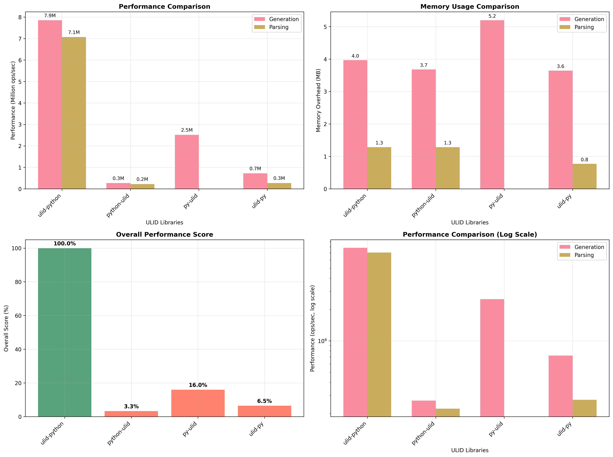

# Python ULID Library Benchmark

This project benchmarks different Python ULID libraries to compare their performance in generation and parsing operations.

## Quick Start

### Run Individual Library Tests

```bash
# Test ulid-python (Rust-powered)
uv run python quick_benchmark.py ulid-python

# Test python-ulid
uv run python quick_benchmark.py python-ulid

# Test py-ulid
uv run python quick_benchmark.py py-ulid

# Test ulid-py
uv run python quick_benchmark.py ulid-py

# Save results to file
uv run python quick_benchmark.py ulid-python --output my_results.json
```

### Generate Visualization and Summary

After running tests and generating JSON files, create performance charts and summary:

```bash
# Generate charts and summary report
uv run python visualize_simple_results.py
```

This creates:
- `quick_benchmark_results.png` - Performance visualization charts
- `QUICK_BENCHMARK_SUMMARY.md` - Detailed analysis report

## Performance Results



The benchmark results show performance across different ULID libraries on an 8-core, 16GB system running Python 3.12.3.

### Key Results Summary

| Rank | Library | Generation (M ops/sec) | Parsing (M ops/sec) | Overall Score |
|------|---------|------------------------|---------------------|---------------|
| 1 | ulid-python | 7.57 | 6.59 | 100.0% |
| 2 | py-ulid | 2.51 | 0.00 | 16.6% |
| 3 | ulid-py | 0.75 | 0.28 | 7.0% |
| 4 | python-ulid | 0.26 | 0.22 | 3.4% |

**ulid-python** demonstrates exceptional performance with **30x faster** generation than python-ulid and complete parsing functionality.

## Available Options

- **Library choices**: ulid-python, python-ulid, py-ulid, ulid-py
- **Output file**: --output or -o to save JSON results
- **Help**: --help for usage information

## Test Configuration

- **Iterations**: 100,000 per test
- **Environment**: Laptop Machine
