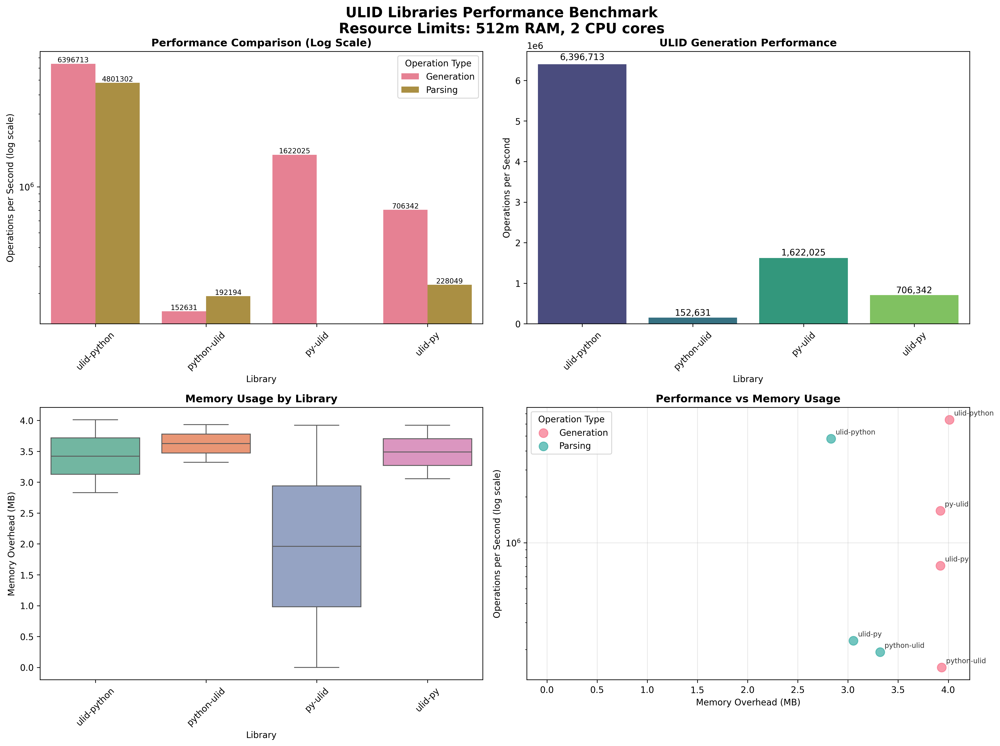

# Docker-Based ULID Benchmark

This benchmark system runs each ULID library in isolated Docker containers with controlled resource limits to ensure fair comparison.

### Prerequisites
- Docker installed and running
- Python 3.8+ with pip or uv

### Run Complete Benchmark

```bash
# 1. Install visualization dependencies
uv add matplotlib seaborn pandas numpy

# 2. Run all benchmarks (builds images, runs tests, cleans up)
uv run python docker-benchmark/run_benchmark.py

# 3. Generate charts and summary
uv run python docker-benchmark/visualize_results.py
```

## Libraries Tested

1. **ulid-python** - [ulid-python](https://pypi.org/project/ulid-python)
2. **python-ulid** - [python-python](https://pypi.org/project/python-ulid/)
3. **py-ulid** - [py-ulid](https://pypi.org/project/py-ulid/)
4. **ulid-py** - [ulid-py](https://pypi.org/project/ulid-py/)

## Benchmark Categories

### **Generation Test**
**What it tests**: Creating new ulid
- **Example scenario**: `user_id = create_new_ulid()` when registering users
- **Iterations**: 100,000 per library

### **Parsing Test** 
**What it tests**: Timestamp-related operations (extraction or generation)
- **Example scenarios**: 
  - Extract creation time from ULID without hitting database
  - Generate ULID for specific timestamp for historical data
- **Iterations**: 100,000 per library
- **Note**: Different libraries implement this differently (extraction vs generation)

## Resource Constraints

Each container runs with:
- **Memory**: 512MB RAM limit
- **CPU**: 2 cores maximum
- **Swap**: Disabled
- **Timeout**: 3 minutes per benchmark

## Output Files

- `consolidated_results.json` - Raw benchmark data
- `benchmark_summary.csv` - Summary table  
- `ulid_benchmark_comparison.png` - Performance charts (shown above)

## Understanding Results

### Performance Metrics Explained

#### **Operations Per Second (ops/sec)**
- **What it means**: How many operations completed in one second
- **Higher = Better**: 6,000,000 ops/sec is faster than 1,000,000 ops/sec

#### **Memory Overhead (MB)**
- **What it measures**: Extra RAM used during operations
- **Lower = Better**: Less memory = lower server costs
- **Components**:
  - **Baseline**: Memory before starting test
  - **Peak**: Maximum memory during test
  - **Overhead**: Peak - Baseline (the extra memory needed)

#### **Relative Performance (%)**
- **How it works**: Each library compared to the fastest one
- **100%** = Fastest library in that category
- **50%** = Half as fast as the fastest
- **Example**: If fastest does 8M ops/sec, 50% would be 4M ops/sec

#### **Overall Score**
- **Calculation**: Average of relative performance across all categories
- **Why it matters**: Shows best all-around performer
- **Range**: 0% (worst) to 100% (perfect in all categories)
- **Missing features**: Score 0% if library doesn't support operation


### Latest Benchmark Results (Python 3.8, 512MB RAM, 2 CPU cores)



| Library | Generation | Parsing | Overall Score |
|---------|------------|---------|---------------|
| ulid-python | 6,396,713 ops/sec (100%) | 4,801,302 ops/sec (100%) | 100% |
| py-ulid | 1,622,025 ops/sec (25.4%) | 0 ops/sec (0%) | 12.7% |
| ulid-py | 706,341 ops/sec (11.0%) | 228,049 ops/sec (4.8%) | 7.9% |
| python-ulid | 152,631 ops/sec (2.4%) | 192,194 ops/sec (4.0%) | 3.2% |


## Detailed Parameter Reference

### Test Configuration
| Parameter | Value | Why This Matters |
|-----------|-------|------------------|
| **Memory Limit** | 512MB | Simulates real server constraints |
| **CPU Limit** | 2 cores | Standard production allocation |
| **Python Version** | 3.8 | Compatible with all libraries |
| **Swap** | Disabled | Forces true memory efficiency |
| **Timeout** | 3 minutes | Prevents hanging tests |

### Test Iterations
| Test Type | Iterations | Reason |
|-----------|------------|---------|
| **Generation** | 100,000 | Balance of accuracy vs time |
| **Parsing** | 100,000 | Moderate complexity operation |

### Library APIs Tested

#### **Generation Test**
| Library | Function | What It Does |
|---------|----------|--------------|
| **ulid-python** | `pyulid.ulid()` | Creates new ULID string |
| **python-ulid** | `str(ULID())` | Creates new ULID object, converts to string |
| **py-ulid** | `str(ulid.ULID())` | Creates new ULID object, converts to string |
| **ulid-py** | `ulid.new()` | Creates new ULID object |

#### **Parsing Test** 
| Library | Function | What It Does |
|---------|----------|--------------|
| **ulid-python** | `pyulid.ulid_timestamp(ulid)` | **Extract timestamp from existing ULID** |
| **python-ulid** | `ULID.from_str(ulid).timestamp` | **Extract timestamp from existing ULID** |
| **py-ulid** | `ulid.ULID.from_str(ulid).timestamp` | **Extract timestamp from existing ULID** |
| **ulid-py** | `ulid.from_timestamp(datetime)` | **Generate ULID from timestamp** |

### Real-World Usage Examples

```python
# GENERATION: Creating new records
user_id = create_ulid()          # New user registration
order_id = create_ulid()         # New order placement  
session_id = create_ulid()       # User login session

# PARSING: Time-based operations  
creation_time = extract_timestamp(ulid)
if creation_time < yesterday:
    archive_record(ulid)         # Archive old records
```

## Manual Testing

### Run Individual Library Tests

```bash
# Test ulid-python
docker run --rm -e BENCHMARK_LIBRARY=ulid-python ulid-benchmark-ulid-python

# Test python-ulid
docker run --rm -e BENCHMARK_LIBRARY=python-ulid ulid-benchmark-python-ulid

# Test py-ulid  
docker run --rm -e BENCHMARK_LIBRARY=py-ulid ulid-benchmark-py-ulid

# Test ulid-py
docker run --rm -e BENCHMARK_LIBRARY=ulid-py ulid-benchmark-ulid-py

```

### Quick Interactive Tests

```bash
# Test each library's basic functionality
docker run --rm ulid-benchmark-ulid-python python -c "import pyulid; print(f'ULID: {pyulid.ulid()}')"
docker run --rm ulid-benchmark-python-ulid python -c "from ulid import ULID; print(f'ULID: {ULID()}')"
docker run --rm ulid-benchmark-py-ulid python -c "import ulid; print(f'ULID: {ulid.ULID()}')"
docker run --rm ulid-benchmark-ulid-py python -c "import ulid; print(f'ULID: {ulid.new()}')"
```

### Build and Test Manually

```bash
# Build specific image first
docker build -f Dockerfile.ulid-python -t ulid-benchmark-ulid-python .

# Run with resource limits
docker run --rm --memory=512m --cpus=2 \
  -e BENCHMARK_LIBRARY=ulid-python \
  ulid-benchmark-ulid-python
```

### API Usage Examples

Each library has different import patterns and functions:

```python
# ulid-python
import pyulid
ulid = pyulid.ulid()                    # Generation
timestamp = pyulid.ulid_timestamp(ulid) # Parsing (timestamp extraction)

# python-ulid  
from ulid import ULID
ulid = str(ULID())                      # Generation
timestamp = ULID.from_str(ulid).timestamp # Parsing (timestamp extraction)

# py-ulid
import ulid  # Note: conflicts with ulid-py
ulid_obj = ulid.ULID()                  # Generation
ulid_str = str(ulid_obj)
# Parsing: ulid.ULID.from_str(ulid_str).timestamp (fails in this library)

# ulid-py
import datetime
import ulid  # Note: conflicts with py-ulid  
ulid = ulid.new()                       # Generation
# Parsing: Generate from timestamp
timestamped_ulid = ulid.from_timestamp(datetime.datetime(2023, 1, 1))

```

## Troubleshooting

**Docker not found**: Install Docker Desktop or Docker Engine 
**Build failures**: Some libraries may not build on all platforms 
**Permission errors**: Ensure Docker daemon is running 
**Memory errors**: Increase Docker memory allocation 

## Benchmark Directory

```
docker-benchmark/
├── run_benchmark.py          # Main orchestrator
├── benchmark_runner.py       # Individual benchmark script
├── visualize_results.py      # Chart generation
├── Dockerfile.ulid-python   # ulid-python
├── Dockerfile.python-ulid   # python-ulid
├── Dockerfile.py-ulid       # py-ulid  
└── Dockerfile.ulid-py       # ulid-py
```
